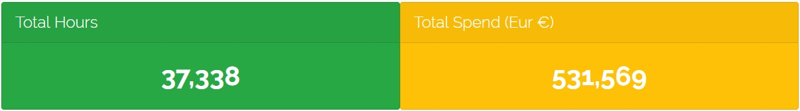
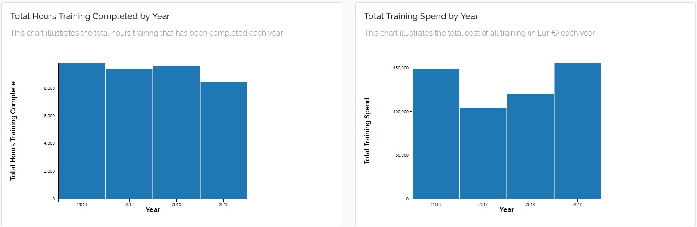
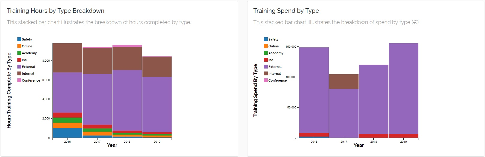
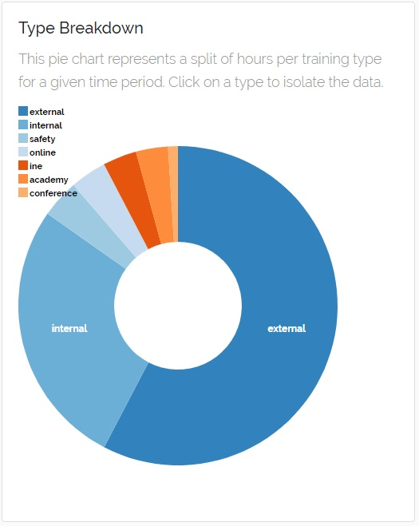
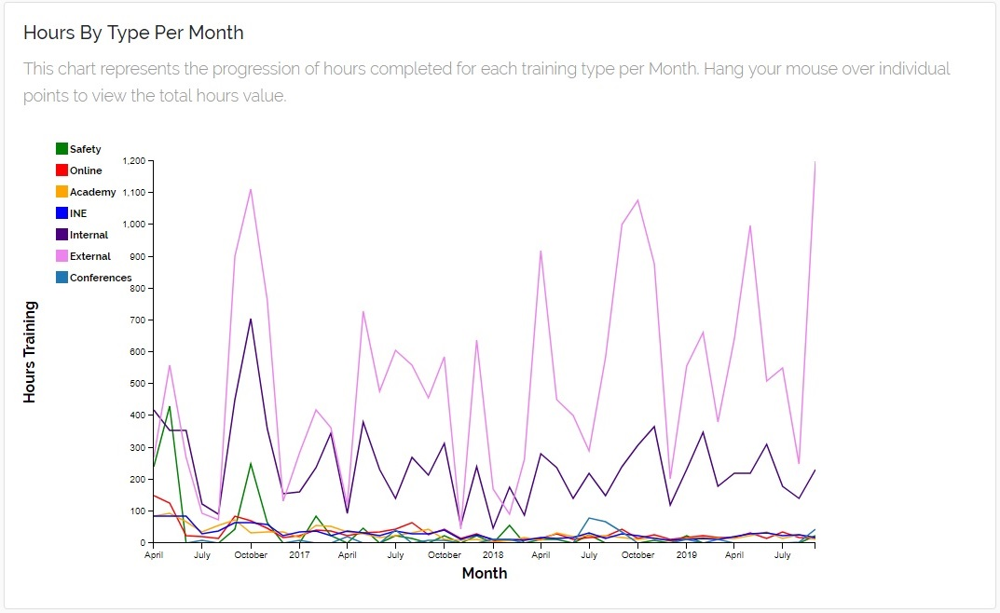
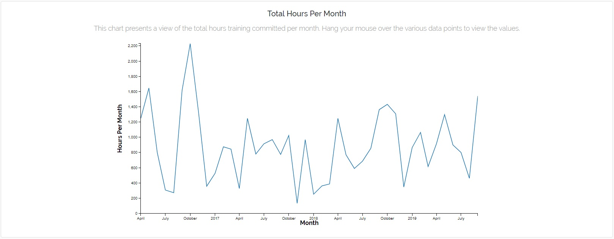
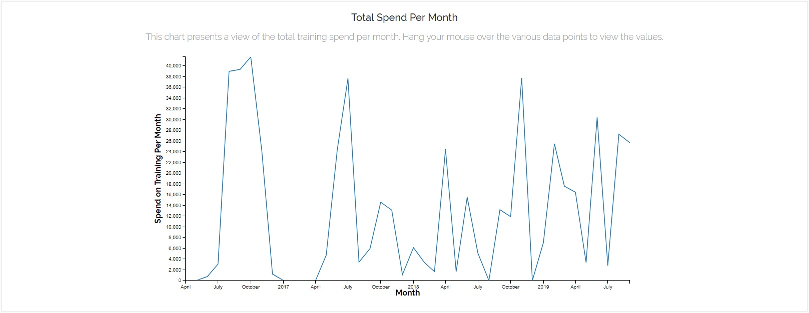

# Damien Meere - BT Ireland
Interactive Frontend Development Milestone Project - Code Institute

This project website will highlight my capability to employ the various tools illustrated throughout the Interactive frontend development section of the Code Institute programme.
This project will present a dashboard of mock training data, presenting a visual representation of data within interactive charts. Ultimately, as will be discussed within the UX + User
Story section, the goal is to make analysis and processing of training data easier to understand, and more actionable by upper management.

### Table of Contents

- [Demo](#Demo)
- [Database](#Database)
- [UX + User Stories](#UX+User-Stories)
- [Technologies](#Technologies)
- [Site Notes](#Site-Notes)
- [Current Features](#Current-Features)
- [Future Features](#Future-Features)
- [Testing](#Testing)
- [Testing -  Unresolved Bugs](#Testing-Unresolved_Bugs)
- [Deployment](#Deployment)
- [Media](#Media)
- [Acknowledgements](#Acknowledgements)
- [Content](#Content)

## Demo
A live demo of the dashboard can be found [Here](https://damien-meere.github.io/interactive_frontend_milestone/)

## Database
[data_consol.json](https://github.com/damien-meere/interactive_frontend_milestone/blob/master/assets/data/data_consol.json)
File consists of 6 key: value pairs. These pairs consist of data amalgamated from the dataset1, dataset2 and dataset3 files, all visible
within the [Data Folder](https://github.com/damien-meere/interactive_frontend_milestone/tree/master/assets/data).The excel file accessible
in the Data Folder also contains the data as laid out before consolidation within the data_consol file. The data_consol folders keys are as follows:
1. the date,
2. the year,
3. the month,
4. the type of training,
5. the hours committed to that type of training and
6. the overall spend for that type training.

The values for these keys contain the useful information that will be broken down and represented in a meaningful way in the dashboard. The reason for
the separation of the date, year and month, is to make the visualisation of the monthly totals easier to work with and visualise.

The data itself is mocked from existing datasets within BT. The original real data will be utilised for deployment on an internal training dashboard.

## UX+User-Stories
My goal in building this dashboard was to make it easier to observe data related to training activites within BT Ireland, and ultimately draw meaning from this data in a efficient
manner. Therefore I ensured that the site would be easy to navigate and any charts would be easy to understand. Given this dashboard is to be employed within BT Ireland to present
real data, in designing this site, I started with a number of user stories:

1. Management looking to quickly determine the progress of training practices across large timeframes
2. Training Lead looking to monitor training closely, and attempt to plan for the year ahead by identifying trends in data (busy/slow periods, when most money is spent etc.)

From these user-stories it was clear that quick and easy access to information would be key to ensuring that users could make the most efficient use of the dashboard. I needed to
make sure that users could quickly navigate the site, and locate any information they required with minimal prompting. As illustrated by the images in the wireframe folder,
particularly the index_design images, even from the early designs, I wanted to ensure the site was easy-to-navigate and minimalist to ensure the user was able to quickly assimilate
the information required. Also within this wireframe folder is a number of designs for both the navbar (full and collapsed) and footer, as well as designs for the course booking modals so prevalent throughout the site. The Technical training page design is also illustrated here, with this scrollable panelled format being repeated throughout the site in the other pages.

## Technologies
1. HTML
2. CSS
3. Bootstrap (4.3.1)
4. FontAwesome
5. Google Font - [Raleway](https://fonts.google.com/specimen/Raleway)
6. JQuery
7. D3 - a JavaScript library for manipulating data, particularly to render our interactive charts and graphs
8. DC - a JavaScript library for data visualization, here for plotting the charts
9. Crossfilter
10. Queue - an asynchronous helper library for JavaScript
11. Intro.js (2.9.3) - Step-Bt-Step introductory tour through the dashboard for first time users.

## Site-Notes
This site is a simple two page structure with one page to house the data visualisations in a [dashboard](https://damien-meere.github.io/interactive_frontend_milestone/).
The other page houses a [contact form](https://damien-meere.github.io/interactive_frontend_milestone/contact.html), where site users can submit any queries they might
have pertaining to the data contained within the dashboard.

I've implemented a sidebar navigation on this site to allow for further additions to the site, such as data collection portals, as discussed in the Future Features section.

## Current-Features
The purpose of this dashboard, as outlined in the UX+User-Stories section, is to breakdown and visualise the training data for all training committed and finances spent
on training throughout the last number of years. The following is description of year chart used and it's significance:

1. Total Hours and Total Spend Number Displays

This is the headline visual on the site, as this gives the total hours training committed, as well as the total spend on training. Again, both of these figures would
be of significant interest to management looking to make swift observations of the training data.

2. Annual Breakdown of Hours and Spend (Bar Chart & stacked Bar Chart variations)

These two sets of chats provide a site user with a quick view of the totals per annual period for the training hours and training spend. The first two charts just
give the absolute total for both of these datasets. While the latter two present a similar view with all types broken out. These charts can be further filter depending
on the user choices within the dropdown menus, or through interactions with other charts. But again, the purpose of these charts is to make quick comparisons or progress
across 12 month periods.

3. Pie Chart detailing the various types of training undertaken

This chart presents another view of the training type breakdown, again depending on the chosen time period (Through interactions with other charts). By selecting an
individual slice from the pie chart, you can also filter that data in the other charts and view additional detail about that specific training type.

4. Composite Line chart illustrating the breakdown of Hours per training type per month

This composite line chart displays the progression of the hours completed for various training types, by date. From this chart we can compare the various training types
over a long period of time, and compare them against each other over time.

5. Breakdown of Total Hours and Spend over the last number of years

These two line charts present the total hours committed and the total spend over time. Within these charts, the dashboard user can also select a specific time period
to view records, rather than just the full year. From here again, all the charts in the dashboard can be filtered down to a much more specific time, allowing the user
to make more specific determinations about the training.

An introductory tour utility has been implemented within the dashboard to guide first time users through the various sections of the dashboard, and provide a brief
introduction to each chart type. [Intro.js](https://introjs.com/) is utilised to support this functionality.

## Future-Features
In it's current form, the dashboard draws it's data from a static dataset - [data_consol.json](https://github.com/damien-meere/interactive_frontend_milestone/blob/master/assets/data/data_consol.json).
In the next iteration of the project, the dashboard will draw data from a live backend database. Therefore the next iteration of the dashboard will also contain data
collection portals to allow for the inputting of up to date data.

In it's current form, the dashboard is exclusively for desktop consumption. In the next iteration of the project, I will be implementing mobile first principles,
and building responsive charts that will accommodate for varying screen sizes.

## Testing
During initial building of the Dashboard, the requisite data was split across three separate datasets. Therefore some charts related to different datasets, and as such,
were not directly linked within the site. In the early phase of the project I decided to consolidate this data into a single file (using mocked data). This meant that the
data refinement dropdown menus and charts could be linked, making it overall, much easier for someone to understand the data, in line with the stated user stories.

All CSS and HTML files were passed through code validators. The [CSS Validator](https://jigsaw.w3.org/css-validator/) & [HTML Validator](https://validator.w3.org)
checked the markup validity of Web documents against the w3c standards.

All links on each page were individually tested to ensure they navigated to the requisite page.

This site was tested across multiple browsers (Chrome, Safari, Firefox), and on multiple devices (Samsung Galaxy S8/S9/S10, Samsung Galaxy Tab, Apple iPad, iPhone 6/7/8)
to ensure compatibility and responsiveness. As detailed in the next section, the display of charts is somewhat unresponsive on smaller screens, and the current iteration
is suited to desktop presentation.

## Testing-Unresolved_Bugs
During the site build, a number of issues arose from the lack of responsiveness from the dc charts. On smaller screens, the charts maintain their size and require
side scrolling, which is less than ideal. As highlighted in the Future-Features section, this will be addressed in future iterations of this project.

## Deployment
This site is hosted using GitHub pages, deployed directly from the master branch. The deployed site will update automatically upon new commits to the master branch.
In order for the site to deploy correctly on GitHub pages, the landing page is named `index.html`, and the current live site can be accessed [HERE](https://damien-meere.github.io/interactive_frontend_milestone/).

To run locally, you can clone this repository directly into the editor of your choice by pasting `git clone https://github.com/damien-meere/interactive_frontend_milestone.git` into your terminal.
To cut ties with this GitHub repository, type `git remote rm origin` into the terminal.

You can also Clone this Repository to GitHub Desktop, by navigating to the [main page](https://github.com/damien-meere/interactive_frontend_milestone) of the repository on GitHub, under the repository
name, click Clone or download. Click Open in Desktop to clone the repository and open it in GitHub Desktop. Click Choose... and, using Windows Explorer, navigate to a local path where you
want to clone the repository. For more information you can review the [GitHub site](https://help.github.com/en/articles/cloning-a-repository#cloning-a-repository-to-github-desktop).

### Acknowledgements
[Intro.js](https://introjs.com/) is an open-source utility the facilitates a step-by-step guide through a site. In this case, the utility is employed to guide first
time users through the various charts, and provide a brief description of the chart context.

### Content
All data contained within this site is mocked up, so as to give a view of data visualisation. This dashboard will be presented internally within BT Ireland with the
correct data in place.

**This site is for educational purposes**